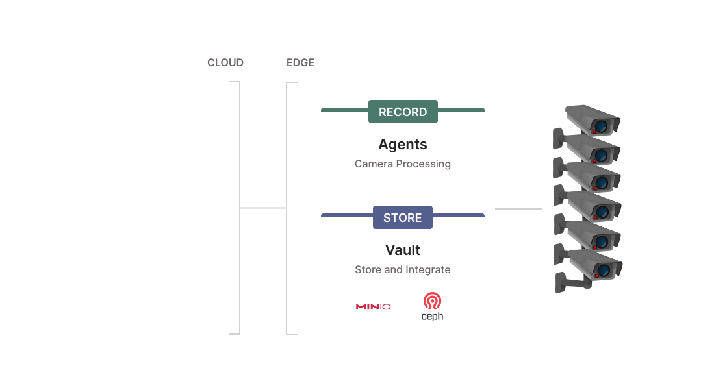
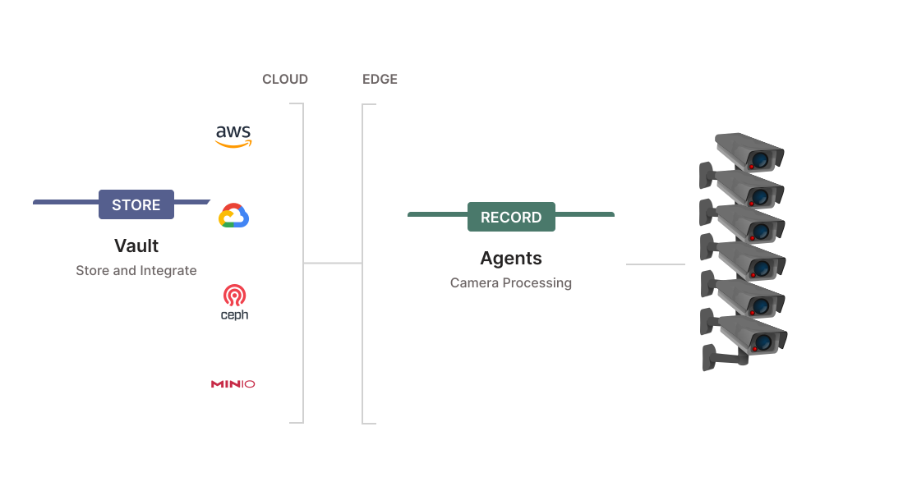

# Kerberos Vault

Kerberos Agents store recordings on the local disk. To centralise your data at a single place, additional solutions are available. 

## Kerberos Hub (Public edition)
One or more Kerberos Agents, can store their data directly in [Kerberos Hub (Public)](https://doc.kerberos.io/hub/first-things-first/), and benefit from the visualisation layer Kerberos Hub offers. When doing this your recordings will be uploaded inside our internal Kerberos Vault (which is a black box for you).

## Kerberos Vault
In addition to that, you have the option to Bring Your Own Storage (BYOS), using [Kerberos Vault](https://doc.kerberos.io/vault/get-started/). Kerberos Vault allows you to configure the storage providers you want (where you data will be persisted), and allows you to connect to Kerberos Hub in parrallel. These storage provider could live in the cloud such as AWS S3,GCP storage and Azure Blob store, or can be located on premise - at the edge - such as Minio or Ceph.

Despite the flexible storage capabilities, Kerberos Vault is also an open platform, which can be used to build extensions (mobile apps, web apps, machine learning services, etc) and integrations. It allows you to leverage a scalable and stable system as a strong backbone for your video analytics solutions, machine learning algorithms, and more.

## Mission

Both Kerberos Hub and Kerberos Vault belong to the Enterprise suite. The goal of this suite is to support enterprises building a scalable video surveillance infrastructure that is open to support all business processes and usecases. Kerberos Enterprise Suite will do all the heavy lifting in terms scaling the processing and storage of you surveillance cameras. On top of that it will provide integration and extensibility to build your own applications on top of that using Swagger API's, and real-time messaging such as Kafka.

## Installation

For installing Kerberos Vault, you can follow [the how-to on our documentation website](https://doc.kerberos.io/vault/installation). In that documentation you will find all the configuration files used in the installation tutorial. 

## Examples

A couple of [examples can be found here](examples). These examples illustrates how the Kerberos Vault API is working, and how it can be used to develop custom algorithms or applications.
