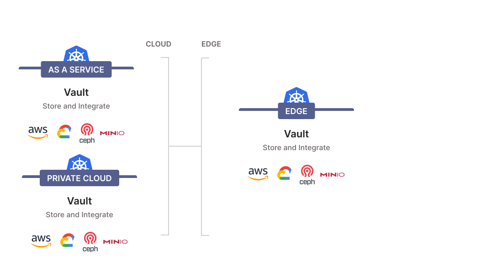
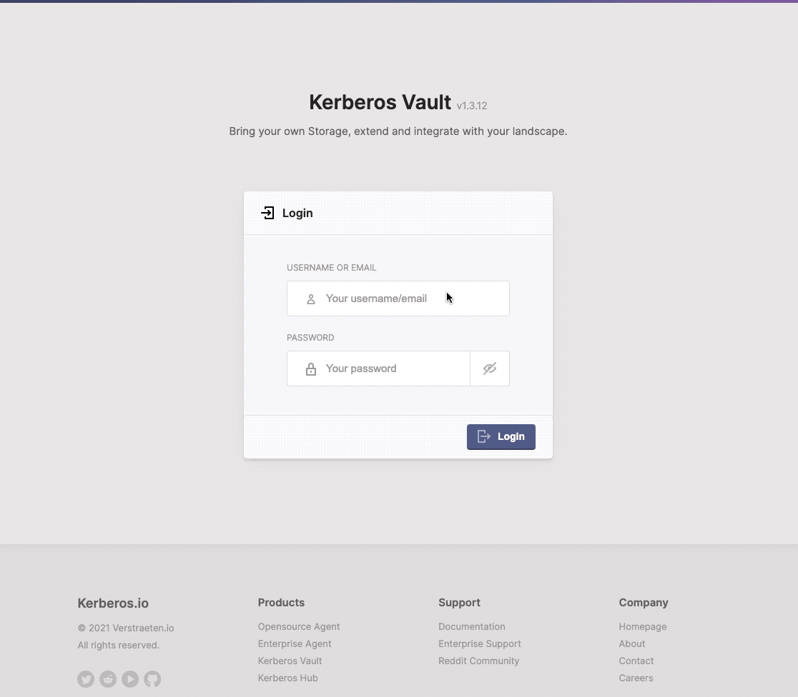

# Kerberos Vault on Kubernetes

As described in the `docker` installation, Kerberos Vault and it's required services are running inside containers. Due to the nature of `docker` and `docker-compose` it's straight forward to setup Kerberos Vault in a few minutes. Using `docker` will give you a good ramp-up speed, but will not provide you with a scalable and resilience deployment.

To overcome this and make Kerberos Vault scale, fault-tolerant and flexible, it's recommended to setup Kerberos Vault in a Kubernetes cluster.

## Managed Kubernetes vs Self-hosted Kubernetes

Just like `docker`, you bring your Kubernetes cluster where you want `edge` or `cloud`; private or public. Depending where you will host and how (e.g. managed Kubernetes cluster vs self-hosted) you'll have less/more responsibilities and/or control. Where and how is totally up to you, and your company preferences.

This installation guide will slight modify depending on if you are self-hosting or leveraging a managed Kubernetes service by a cloud provider. Within a self-hosted installation you'll be required to install specific Kubernetes resources yourself, such as persistent volumes, storage and a load balancer.

## :books: Overview

### A. Managed Kubernetes
1. [Prerequisites](#prerequisites)
2. [Introduction](#introduction)
3. [Kerberos Vault](#kerberos-vault)
4. [Namespace](#namespace)
5. [Helm](#helm)
6. [Traefik](#traefik)
7. [Ingress-Nginx (alternative for Traefik)](#ingress-nginx-alternative-for-traefik)
8. [MongoDB](#mongodb)
9. [Config Map](#config-map)
10. [Deployment](#deployment)
11. [Test out configuration](#test-out-configuration)
12. [Access the system](#access-the-system)

### B. Self-hosted Kubernetes
1. [Prerequisites](#prerequisites-1)
2. [Docker](#docker)
3. [Kubernetes](#kubernetes)
4. [Untaint all nodes](#untaint-all-nodes)
5. [Calico](#calico)
6. [Introduction](#introduction-1)
7. [Kerberos Vault](#kerberos-vault-1)
8. [MetalLB](#metallb)
9. [OpenEBS](#openebs)
10. [Proceed with managed Kubernetes](#proceed-with-managed-kubernetes)

### Optional steps
1. [Recycling rules](#recycling-rules)

## A. Managed Kubernetes

To simplify the installation we will start with the most common setup, where we will install Kerberos Vault on a managed Kubernetes services.

As of now there are many cloud providers such as, but not limited too, Azure, Google Cloud, AWS, and many more. Each cloud provider has build a management service on top of Kubernetes which takes over the heavy lifting of managing a cluster yourself. It makes specific resources such as built-in loadbalancers, storage, and more availble for your needs. The cloud provider manages all the complex things for you in the back-end and implements features such as load balancing, data replication etc.

### Prerequisites

For this installation we assume you have chosen a specific cloud provider that provides you with a manager Kubernetes. We'll assume you have the relevant `.kubeconfig` configuration to be able to connect the api server of your Kubernetes installation. Make sure you can run following commands on you cluster.

    kubectl get nodes

or

    kubectl get pods --all-namespaces

### Introduction

Kerberos Vault requires some initial components to be installed. If you run Kerberos Vault in the same cluster as where you have a Kerberos Factory installed, there is not much to do, and you might skip the paragraphs with prerequisite.

If you plan to run Kerberos Vault in a different cluster (which is perfectly possible), you will need to make sure you complete the initial setup of the [Kerberos Factory installation](/factory/installation). To be more specific you will need to have following components running:

- Helm
- MongoDB
- Traefik (or alternatively Nginx ingress)

We'll assume you are starting an installation from scratch and therefore still need to install and configure previously mentioned components.

### Kerberos Vault

We'll start by cloning the configurations from our [Github repo](https://github.com/kerberos-io/vault). This repo contains all the relevant configuration files required.

    git clone https://github.com/kerberos-io/vault

Make sure to change directory to the `kubernetes` folder.

    cd kubernetes

### Namespace

A best practices is to isole tools and/or applications in a namespace, this will group relevant (micro)services. As a best practice we'll create a namespace `kerberos-vault`.

    kubectl create namespace kerberos-vault

This namespace will later be used to deploy the relevant services for Kerberos Vault.

### Helm

Next we will install a couple of dependencies which are required for Kerberos Vault. [**Helm**](https://helm.sh/) is a package manager for Kubernetes, it helps you to set up services more easily (this could be a MQTT broker, a database, etc).
Instead of writing yaml files for every service we need, we use so-called Charts (libraries), that you can reuse and configure the, with the appropriate settings.

Use one of the preferred OS package managers to install the Helm client:

    brew install helm

    choco install kubernetes-helm

    scoop install helm

    gofish install helm

### Traefik

[**Traefik**](https://containo.us/traefik/) is a reverse proxy and load balancer which allows you to expose your deployments more easily. Kerberos uses Traefik to expose its APIs more easily.

Add the Helm repository and install traefik.

    kubectl create namespace traefik
    helm repo add traefik https://helm.traefik.io/traefik
    helm install traefik traefik/traefik -n traefik 

After installation, you should have an IP attached to Traefik service, look for it by executing the `get service` command. You will see the ip address in the `EXTERNAL-IP` attribute.

    kubectl get svc

        NAME                        TYPE           CLUSTER-IP     EXTERNAL-IP     PORT(S)                      AGE
        kubernetes                  ClusterIP      10.0.0.1       <none>          443/TCP                      36h
    --> traefik                     LoadBalancer   10.0.27.93     40.114.168.96   443:31623/TCP,80:31804/TCP   35h
        traefik-dashboard           NodePort       10.0.252.6     <none>          80:31146/TCP                 35h

Go to your DNS provider and link the domain you've configured in the first step `traefik.domain.com` to the IP address of thT `EXTERNAL-IP` attribute. When browsing to `traefik.domain.com`, you should see the traefik dashboard showing up.

### Ingress-Nginx (alternative for Traefik)

If you don't like `Traefik` but you prefer `Ingress Nginx`, that works as well.

    helm repo add ingress-nginx https://kubernetes.github.io/ingress-nginx
    helm repo update
    kubectl create namespace ingress-nginx
    helm install ingress-nginx -n ingress-nginx ingress-nginx/ingress-nginx

### MongoDB

When using Kerberos Vault, it will persist references to the recordings stored in your storage provider in a MongoDB database. As used before, we are using `helm` to install MongoDB in our Kubernetes cluster.

Have a look into the `./mongodb/values.yaml` file, you will find plenty of configurations for the MongoDB helm chart. To change the username and password of the MongoDB instance, go ahead and [find the attribute where](https://github.com/kerberos-io/vault/blob/master/kubernetes/mongodb/values.yaml#L148) you can change the root password.

    helm repo add bitnami https://charts.bitnami.com/bitnami
    kubectl create namespace mongodb

Note: If you are installing a self-hosted Kubernetes cluster, we recommend using `openebs`. Therefore make sure to uncomment the `global`.`storageClass` attribute, and make sure it's using `openebs-hostpath` instead.

    helm install mongodb -n mongodb bitnami/mongodb --values ./mongodb/values.yaml

Once installed successfully, we should verify if the password has been set correctly. Print out the password using `echo $MONGODB_ROOT_PASSWORD` and confirm the password is what you've specified in the `values.yaml` file.

    export MONGODB_ROOT_PASSWORD=$(kubectl get secret -n mongodb mongodb -o jsonpath="{.data.mongodb-root-password}" | base64 --decode)
    echo $MONGODB_ROOT_PASSWORD

### Config Map

Kerberos Vault requires a configuration to connect to the MongoDB instance. To handle this `configmap` map is created in the `./mongodb/mongodb.config.yaml` file.

Modify the MongoDB credentials in the `./mongodb/mongodb.config.yaml`, and make sure they match the credentials of your MongoDB instance, as described above.

        - name: MONGODB_USERNAME
          value: "root"
        - name: MONGODB_PASSWORD
    -->   value: "yourmongodbpassword"

Create the config map.

    kubectl apply -f ./mongodb/mongodb.config.yaml -n kerberos-vault

### Deployment

Before installing Kerberos Vault, open the `./kerberos-vault/deployment.yaml` configuration file. At the of the bottom file you will find two endpoints, similar to the Ingres file below. Update the hostnames to your own preferred domain, and add these to your DNS server or `/etc/hosts` file (pointing to the same IP as the Traefik/Ingress-nginx EXTERNAL-IP).

        spec:
          rules:
    -->   - host: vault.domain.com
            http:
              paths:
              - path: /
                backend:
                  serviceName: kerberos-vault
                  servicePort: 80
    -->   - host: api.vault.domain.com
            http:
              paths:
              - path: /
                backend:
                  serviceName: kerberos-vault
                  servicePort: 8081

If you are using Ingress Nginx, do not forgot to comment `Traefik` and uncomment `Ingress Nginx`.

    apiVersion: extensions/v1beta1
    kind: Ingress
    metadata:
      name: factory
      annotations:
        #kubernetes.io/ingress.class: traefik
        kubernetes.io/ingress.class: nginx

Once you have corrected the DNS names (or internal /etc/hosts file), install the Kerberos Factory web app inside your cluster.

    kubectl apply -f ./kerberos-vault/deployment.yaml -n kerberos-vault

### Test out configuration

If everything worked out as expected, you should now have following services in your cluster across different namespaces:

- MongoDB
- Traefik
- Kerberos Vault

It should look like this.

    $ kubectl get pods -n kerberos-vault
    NAME                              READY   STATUS    RESTARTS   AGE
    kerberos-vault-6f5c877d7c-hf77p          1/1     Running   0          2d11h

    $ kubectl get pods -n mongodb
    NAME                              READY   STATUS    RESTARTS   AGE
    mongodb-758d5c5ddd-qsfq9          1/1     Running   0          5m31s

    $ kubectl get pods -n traefik
    NAME                              READY   STATUS    RESTARTS   AGE
    traefik-7d566ccc47-mwslb          1/1     Running   0          4d12h

### Access the system

Once everything is configured correctly your cluster and DNS or `/etc/hosts` file, you should be able to access the Kerberos Vault application. By navigating to the domain `vault.domain.com` in your browser you will see the Kerberos Vault login page showing up.

## B. Self-hosted Kubernetes

You might have the requirement to self-host your Kubernetes cluster due to various good reasons. In this case the installation of Kerberos Vault will be slightly "more" difficult, in the sense that specific resources are not available by default; compared to the managed Kubernetes installation.

The good things is that installation of a self-hosted Kubernetes cluster, contains the same steps as a managed Kubernetes installation with a few extra resources on top. 

### Prerequisites

We'll assume you have a blank Ubuntu 20.04 LTS machine (or multiple machines/nodes) at your posession. We'll start with updating the Ubuntu operating system.

    apt-get update -y && apt-get upgrade -y

### Docker

Let's install our container runtime `docker` so we can run our containers.

    apt install docker.io -y

Once installed modify the `cgroup driver`, so kubernetes will be using it correctly. By default Kubernetes cgroup driver was set to systems but docker was set to systemd.

    sudo mkdir /etc/docker
    cat <<EOF | sudo tee /etc/docker/daemon.json
    {
      "exec-opts": ["native.cgroupdriver=systemd"],
      "log-driver": "json-file",
      "log-opts": {
        "max-size": "100m"
      },
      "storage-driver": "overlay2"
    }
    EOF
    
    sudo systemctl enable docker
    sudo systemctl daemon-reload
    sudo systemctl restart docker

### Kubernetes

After Docker being installed go ahead and install the different Kubernetes servicess and tools.

    apt update -y
    apt install apt-transport-https curl -y
    curl -s https://packages.cloud.google.com/apt/doc/apt-key.gpg | apt-key add
    apt-add-repository "deb http://apt.kubernetes.io/ kubernetes-xenial main"
    apt update -y && apt install kubeadm kubelet kubectl kubernetes-cni -y

Make sure you disable swap, this is required by Kubernetes.

    swapoff -a

And if you want to make it permanent after every boot.

    sudo sed -i.bak '/ swap / s/^\(.*\)$/#\1/g' /etc/fstab

***Special note***: If you already had Kubernetes installed, make sure you are running latest version and/or have properly cleaned up previous installation.

    kubeadm reset
    rm -rf $HOME/.kube

Initiate a new Kubernetes cluster using following command. This will use the current CIDR. If you want to use another CIDR, specify following arguments: `--pod-network-cidr=10.244.0.0/16`.

    kubeadm init

Once successful you should see the following. Note the `discovery token` which you need to use to connect additional nodes to your cluster.

    Your Kubernetes control-plane has initialized successfully!

    To start using your cluster, you need to run the following as a regular user:

      mkdir -p $HOME/.kube
      sudo cp -i /etc/kubernetes/admin.conf $HOME/.kube/config
      sudo chown $(id -u):$(id -g) $HOME/.kube/config

    You should now deploy a pod network to the cluster.
    Run "kubectl apply -f [podnetwork].yaml" with one of the options listed at:
      https://kubernetes.io/docs/concepts/cluster-administration/addons/

    Then you can join any number of worker nodes by running the following on each as root:

    kubeadm join 192.168.1.103:6443 --token ej7ckt.uof7o2iplqf0r2up \
        --discovery-token-ca-cert-hash sha256:9cbcc00d34be2dbd605174802d9e52fbcdd617324c237bf58767b369fa586209

Now we have a Kubernetes cluster, we need to make sure we add make it available in our `kubeconfig`. This will allow us to query our Kubernetes cluster with the `kubectl` command.

    mkdir -p $HOME/.kube
    cp -i /etc/kubernetes/admin.conf $HOME/.kube/config
    chown $(id -u):$(id -g) $HOME/.kube/config

### Untaint all nodes

By default, and in this example, we only have one node our master node. In a production scenario we would have additional worker nodes. By default the master nodes are marked as `tainted`, this means they cannot run workloads. To allow master nodes to run workloads, we need to untaint them. If we wouldn't do this our pods would never be scheduled, as we do not have worker nodes at this moment.

    kubectl taint nodes --all node-role.kubernetes.io/master-

### Calico

Calico is an open source networking and network security solution for containers, virtual machines, and native host-based workloads. (https://www.projectcalico.org/). We will use it as our network layer in our Kubernetes cluster. You could use otthers like Flannel aswell, but we prefer Calico.

    curl https://docs.projectcalico.org/manifests/calico.yaml -O
    kubectl apply -f calico.yaml

### Introduction

As you might have read in the `A. Managed Kubernetes` section, Kerberos Vault requires some initial components to be installed.

- Helm
- MongoDB
- Traefik (or alternatively Nginx ingress)

However for a self-hosted cluster, we'll need following components on top:

- MetalLB
- OpenEBS

For simplicity we'll start with the installation of `MetalLB` and `OpenEBS`. Afterwards we'll move back to the `A. Managed Kubernetes` section, to install the remaining components.

### Kerberos Vault

We'll start by cloning the configurations from our [Github repo](https://github.com/kerberos-io/vault). This repo contains all the relevant configuration files required.

    git clone https://github.com/kerberos-io/vault

Make sure to change directory to the `kubernetes` folder.

    cd kubernetes

### MetalLB

In a self-hosted scenario, we do not have fancy Load balancers and Public IPs from which we can "automatically" benefit. To overcome thism, solutions such as MetalLB - Baremetal Load Balancer - have been developed (https://metallb.universe.tf/installation/). MetalLB will dedicate an internal IP address, or IP range, which will be assigned to one or more Load Balancers. Using this dedicated IP address, you can reach your services or ingress.

    kubectl apply -f https://raw.githubusercontent.com/metallb/metallb/v0.9.5/manifests/namespace.yaml
    kubectl apply -f https://raw.githubusercontent.com/metallb/metallb/v0.9.5/manifests/metallb.yaml
    kubectl create secret generic -n metallb-system memberlist --from-literal=secretkey="$(openssl rand -base64 128)"

After installing the different MetalLB components, we need to modify a `configmap.yaml` file, which you can find here `./metallb/configmap.yaml`. This file contains information of how MetalLB can get and use internal IP's as LoadBalancers.

      apiVersion: v1
      kind: ConfigMap
      metadata:
        namespace: metallb-system
        name: config
      data:
        config: |
          address-pools:
          - name: default
            protocol: layer2
            addresses:
    -->     - 192.168.1.200-192.168.1.210

You can change the IP range above to match your needs. MetalLB will use this range as a reference to assign IP addresses to your LoadBalancers. Once ready you can apply the configuration map.

    kubectl apply -f ./metallb/configmap.yaml

Once installed, all services created in your Kubernetes cluster will receive an unique IP address as configured in the `configmap.yaml`.

### OpenEBS

Some of the services we'll leverage such as MongoDB or Minio require storage, to persist their data safely. In a managed Kubernetes cluster, the relevant cloud provider will allocate storage automatically for you, as you might expect this is not the case for a self-hosted cluster.

Therefore we will need to prepare some storage or persistent volume. To simplify this we can leverage the OpenEBS storage solution, which can automatically provision PV (Persistent volumes) for us.

Let us start with installing the OpenEBS operator. Please note that you might need to change the mount folder. Download the `openebs-operator.yaml`.

    wget https://openebs.github.io/charts/openebs-operator.yaml

 Scroll to the bottom, until you hit the `StorageClass` section. Modify the `BasePath` value to the destination (external mount) you prefer.

    #Specify the location (directory) where
    # where PV(volume) data will be saved.
    # A sub-directory with pv-name will be
    # created. When the volume is deleted,
    # the PV sub-directory will be deleted.
    #Default value is /var/openebs/local
    - name: BasePath
      value: "/var/openebs/local/"
  
Once you are ok with the `BasePath` go ahead and apply the operator.

    kubectl apply -f openebs-operator.yaml

Once done it should start installing several resources in the `openebs` namespace. If all resources are created successfully we can launch the `helm install` for MongoDB.

### Proceed with managed Kubernetes

Now you're done with installing the self-hosted prerequisites, you should be able to proceed with the [A. Managed Kubernetes](#a-managed-kubernetes) section. This will install all the remaining resources.

Next to persisting your recordings, recycling up is evenly important. Recycling avoids your disks being filled up with recordings and locking up the entire OS and cluster, and also important helps you to reduce costs. Recycling is managed through a recycle service called Kerberos Vault Recycle, which you can use to remove recordings based on different rules.

## Optional steps

Next to Kerberos Vault, additional deployments/sidecars can be installed to fullfil a specific task.

### Recycling rules

Different recycling rules can be defined. A rule determines when and how recordings should be removed. For more information of how recycling works, [read the documentation](https://doc.kerberos.io/vault/recycle/).

#### Prerequisites

This installation guide assumes you have set up Kerberos Vault properly.

#### Installation

Create the recycle deployment as following.

    git clone https://github.com/kerberos-io/vault && cd vault/kubernetes
    kubectl apply -f ./kerberos-vault/deployment-cleanup.yaml -n kerberos-vault