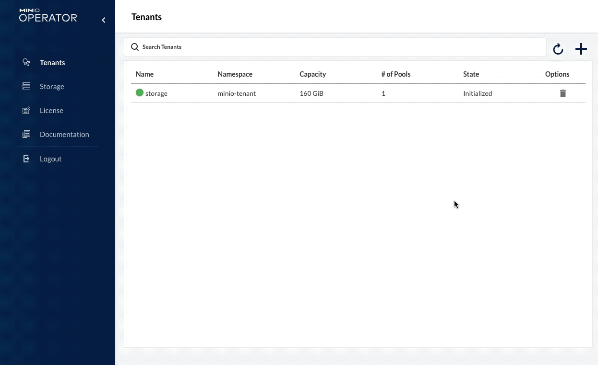
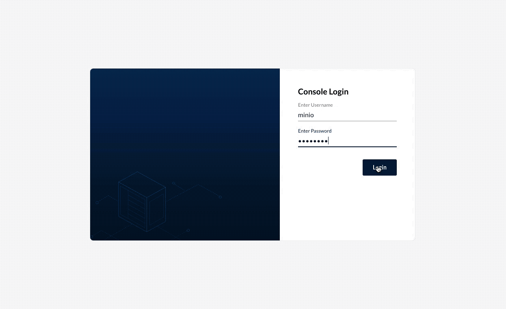

# Minio

Minio is a recommended solution if you would like to persist your recordings at the edge. To set up Minio you have to configure a few Kubernetes resources. To simplify the installation, we will go ahead with the Minio operator.

The Minio operator can be used to set up a production ready Minio cluster, with multiple nodes and drives. Using the concept of Minio tenants you can scale your Minio cluster easily.

    kubectl krew update
    kubectl krew install minio

To install krew in your `kubectl` toolkit, following [the offical documentation](https://krew.sigs.k8s.io/docs/user-guide/setup/install/).

    kubectl minio version
    kubectl minio init

Run the following command to verify the status of the Operator:

    kubectl get pods -n minio-operator

Run the following command to create a local proxy to the MinIO Operator Console:

    kubectl minio proxy -n minio-operator

Once you have the Console open, you can go ahead and create/configure a MinIO tenant. To simplify the creation of a tenant we will apply following manifests, this will create a tenant for us with the proper configuration; feel free to tweak this to your own needs (testing/production).

In the below manifests we have been using the OpenEBS storage class for local-storage. Please note that you can use whatever storage provider you like, make sure you change the relevant configuration files.

    kubectl apply -f https://openebs.github.io/charts/openebs-operator.yaml

Once you have selected your storage class, or installed OpenEBS, go ahead by applying the different manifests. Below configuration will deploy a single server, with 4 volumes of 10Gb. It will also create a default access key (`minio`) and secret key (`minio123`). 

    git clone https://github.com/kerberos-io/vault && cd vault/kubernetes/minio
    kubectl create namespace minio-tenant
    kubectl apply -f minio.cred.yaml
    kubectl apply -f minio.config.tenant.yaml
    kubectl apply -f minio.tenant.yaml

Once applied the MinIO tenant will be created, and you should see some pods being created in the `minio-tenant` namespace. Once everything is ready you should be able to access to MinIO Tenant console by forwarding the service.

    kubectl get svc -n minio-tenant
    kubectl port-forward svc/minio-console 9090 -n minio-tenant

While accessing the console, you can create a new Bucket.

